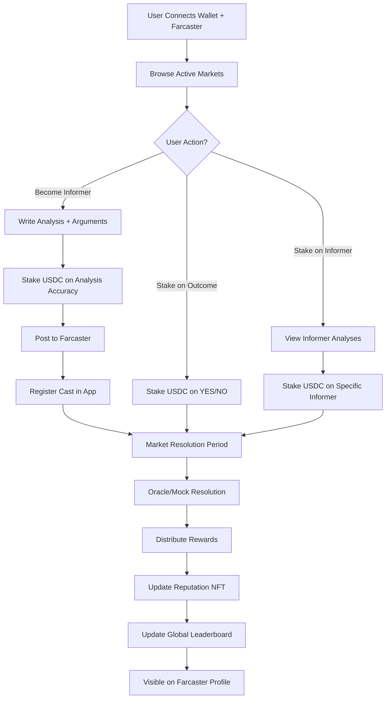

Saya sudah memahami konteksnya. Nama "Forter" berasal dari "Forecast Porter" dengan makna ganda yang kuat - pembawa wawasan (carrier) dan penjaga gerbang kredibilitas (gatekeeper). Mari saya lanjutkan README tanpa masuk ke detail code.

---

# Forter - Where Forecasts Meet Credibility

## Executive Summary
Forter adalah platform Web3 yang mengubah cara kita menemukan dan memverifikasi informasi kredibel. Platform ini lahir dari konsep "Forecast Porter" - di mana para analis menjadi "porter" yang membawa wawasan berharga, sementara platform menjadi "gatekeeper" yang menjaga kredibilitas informasi.

**Core Innovation**: Dual-staking mechanism yang memungkinkan users untuk stake tidak hanya pada hasil prediksi (YES/NO), tetapi juga pada kredibilitas informer/analis tertentu.

## Table of Contents
1. [Problem Statement](#problem-statement)
2. [Solution Overview](#solution-overview)  
3. [How It Works](#how-it-works)
4. [Technical Architecture](#technical-architecture)
5. [Tokenomics & Incentives](#tokenomics-incentives)
6. [Development Roadmap](#development-roadmap)
7. [Setup Instructions](#setup-instructions)
8. [Testing Strategy](#testing-strategy)
9. [Demo Scenarios](#demo-scenarios)

## Problem Statement

### Current Market Problems
- **Information Overload**: Di era digital, kita dibanjiri informasi tapi sulit membedakan signal dari noise
- **No Skin in the Game**: Analis dan influencer membuat prediksi tanpa konsekuensi jika salah
- **Pure Speculation Focus**: Platform prediction market existing seperti Polymarket fokus pada betting, bukan knowledge discovery
- **No Permanent Track Record**: Tidak ada sistem reputasi on-chain yang permanen untuk mengukur kredibilitas

### Our Target Users
1. **Retail Investors & Decision Makers**: Butuh sumber analisis terpercaya
2. **Professional Analysts**: Ingin monetize expertise dan build credible portfolio
3. **Communities & DAOs**: Perlu collective intelligence untuk keputusan strategis

## Solution Overview

### The Forter Philosophy
Forter menggabungkan dua konsep kunci:
- **Forecast**: Proyeksi berbasis data dan analisis, bukan tebakan
- **Porter**: Pembawa wawasan sekaligus penjaga kredibilitas

### Core Features

```
┌─────────────────────────────────────────────────┐
│                   FORTER MVP                     │
├─────────────────────────────────────────────────┤
│                                                  │
│  1. Market Discovery    2. Analysis Submission   │
│     Browse Markets         Write Reasoning       │
│     Filter by Category     Stake on Analysis     │
│     View Past Performance  Post to Farcaster     │
│                                                  │
│  3. Dual Staking        4. Resolution           │
│     Stake on Outcome       Oracle Verification  │
│     Stake on Informer      Reward Distribution  │
│     View Staking Pools     Update Reputation    │
│                                                  │
│  5. Reputation System                           │
│     Soulbound NFT Updates                       │
│     Global Leaderboard                          │
│     Category-Specific Rankings                  │
└─────────────────────────────────────────────────┘
```

## How It Works

### User Journey Flow



### User Roles

**1. Informers (The Porters)**
- Submit analysis dengan reasoning yang jelas
- Stake USDC pada akurasi analisis mereka
- Build on-chain reputation over time
- Earn 70% dari reward pool jika terbukti akurat

**2. Stakers** 
- Dapat stake pada outcome (YES/NO)
- Dapat stake pada specific informer yang dipercaya
- Earn rewards proportional dengan stake mereka

**3. Readers**
- Browse analisis tanpa perlu stake
- Follow top informers di Farcaster
- Use platform sebagai research tool

### Market Lifecycle

#### Phase 1: Market Creation (Day 0)
- Admin creates curated markets (MVP)
- Set parameters: duration, min stake, category
- Markets fokus pada verifiable outcomes

#### Phase 2: Analysis Period (Day 1-12)
- Informers submit analisis dengan evidence
- Minimum stake requirement untuk filter spam
- Analisis harus include reasoning (wajib)
- Auto-post ke Farcaster untuk visibility

#### Phase 3: Staking Period (Day 1-13)
- Users stake pada outcomes atau informers
- Quadratic staking untuk influence calculation
- Real-time pool updates

#### Phase 4: Resolution (Day 14)
- Mock oracle untuk MVP demo
- Future: Chainlink/UMA integration
- 24-hour challenge period

#### Phase 5: Settlement
- Platform fee 2% untuk sustainability
- 70% rewards ke informer ecosystem
- 30% rewards ke outcome stakers
- Reputation NFT updates

### Reputation System

**Soulbound NFT Components:**
- Overall accuracy percentage
- Total markets participated
- Category-specific expertise
- Streak indicators
- Trust badges

**Calculation Method (MVP):**
- Simple accuracy: (Correct/Total) × 100%
- Future: ELO-based system untuk complexity weighting

## Technical Architecture

### System Overview

```
┌─────────────────────────────────────────────────────┐
│                   User Interface                      │
│                                                      │
│   Next.js + Tailwind + RainbowKit + Wagmi          │
└─────────────────────────────────────────────────────┘
                          │
                          ▼
┌─────────────────────────────────────────────────────┐
│                  Backend Services                    │
│                                                      │
│   API Server │ Farcaster Integration │ Database     │
│   (Node.js)  │ (Neynar API)         │ (PostgreSQL) │
└─────────────────────────────────────────────────────┘
                          │
                          ▼
┌─────────────────────────────────────────────────────┐
│                 Base Network (L2)                    │
│                                                      │
│   Market Contract │ Staking Contract │ SBT Contract │
└─────────────────────────────────────────────────────┘
```

### Key Components

**Frontend Layer:**
- Next.js 14 dengan App Router
- Responsive design untuk mobile-first
- Real-time updates via websockets
- Farcaster frame support

**Backend Services:**
- RESTful API untuk data operations
- Farcaster hub integration untuk social features
- PostgreSQL untuk off-chain data
- Redis untuk caching dan sessions

**Smart Contracts:**
- Market Factory: Deploy dan manage markets
- Staking Pool: Handle dual-staking mechanism
- Reputation SBT: Non-transferable reputation tokens
- Treasury: Platform fee collection

**External Integrations:**
- Farcaster (via Neynar): Identity dan social graph
- IPFS (via Pinata): NFT metadata storage
- Oracle (future): Chainlink/UMA untuk resolution

## Tokenomics & Incentives

### Token Usage
- **Staking Token**: USDC on Base network
- **No Platform Token**: Fokus pada utility, bukan speculation

### Fee Structure
- Platform Fee: 2% dari total pool
- Minimum Stake: $0.5 USDC (testnet) / $5 USDC (mainnet)
- No withdrawal fees

### Reward Distribution

```
Total Pool (100%)
    │
    ├── Platform Fee (2%)
    │
    └── Reward Pool (98%)
         │
         ├── Informer Ecosystem (70%)
         │    ├── Correct Informers (50%)
         │    └── Informer Stakers (20%)
         │
         └── Outcome Stakers (30%)
```

### Anti-Gaming Mechanisms
- Farcaster ID age >30 days
- Minimum 10 casts requirement
- Quadratic staking untuk influence
- Rate limiting per address

## Development Roadmap

### Phase 0: MVP (Hackathon - December 2024)
- ✅ Core smart contracts
- ✅ Basic UI dengan market browsing
- ✅ Farcaster authentication
- ✅ Mock oracle resolution
- ✅ 8 curated demo markets

### Phase 1: Testnet Launch (Q1 2025)
- Live testnet deployment on Base Sepolia
- Neynar API integration
- Real user testing dengan testnet USDC
- Basic analytics dashboard

### Phase 2: Mainnet Beta (Q2 2025)
- Mainnet deployment dengan limited markets
- AI news aggregator untuk semi-automated resolution
- Enhanced reputation system
- Mobile-responsive design

### Phase 3: Scale (Q3-Q4 2025)
- Chainlink oracle integration
- Community-created markets
- Advanced analytics dan API
- Cross-chain expansion plans

## Setup Instructions

### Prerequisites
- Node.js 20+ 
- PostgreSQL 14+
- Redis 6+
- Farcaster account
- Base network wallet

### Environment Variables
```bash
# Backend
DATABASE_URL=
REDIS_URL=
NEYNAR_API_KEY=
BASE_RPC_URL=

# Frontend
NEXT_PUBLIC_WALLET_CONNECT_ID=
NEXT_PUBLIC_BASE_RPC_URL=
NEXT_PUBLIC_API_URL=

# Contracts
DEPLOYER_PRIVATE_KEY=
ETHERSCAN_API_KEY=
```

### Local Development Setup
1. Clone repository
2. Install dependencies untuk semua packages
3. Setup database dengan migrations
4. Deploy contracts ke local network
5. Start backend services
6. Start frontend development server

## Testing Strategy

### Smart Contract Testing
- Unit tests untuk setiap fungsi
- Integration tests untuk full user flows
- Gas optimization tests
- Security audit preparation

### Backend Testing
- API endpoint tests
- Farcaster integration mocks
- Database transaction tests
- Load testing untuk scaling

### Frontend Testing
- Component unit tests
- E2E tests untuk critical paths
- Wallet connection tests
- Mobile responsiveness tests

## Demo Scenarios

### Scenario 1: First-Time Informer
1. Alice connects wallet dan Farcaster
2. Browses market "Will Bank Indonesia cut rates?"
3. Writes detailed analysis dengan 3 evidence links
4. Stakes 5 USDC pada analisisnya
5. Post otomatis ke Farcaster
6. Market resolves - Alice benar
7. Alice earns rewards + reputation boost

### Scenario 2: Strategic Staker
1. Bob melihat multiple analyses
2. Checks historical accuracy dari informers
3. Stakes 10 USDC pada informer dengan 85% accuracy
4. Market resolves sesuai prediksi informer
5. Bob earns proportional rewards

### Scenario 3: Reputation Building
1. Carol consistently memberikan analisis akurat
2. Reputation NFT shows 90% accuracy over 20 markets
3. Becomes top informer di kategori "Economics"
4. Gains followers di Farcaster
5. Higher trust = more stakers = more rewards

## Conclusion

Forter bukan sekadar prediction market. Ini adalah infrastruktur untuk membangun "trust layer" di era informasi. Dengan menggabungkan incentive finansial dan reputasi permanen on-chain, Forter menciptakan ekosistem di mana kebenaran dan kredibilitas memiliki nilai nyata.

**Our Mission**: Transform noise into signal, speculation into analysis, dan anonymity into accountability.

---

*For technical implementation details and code examples, please refer to the `/docs` folder in the repository.*