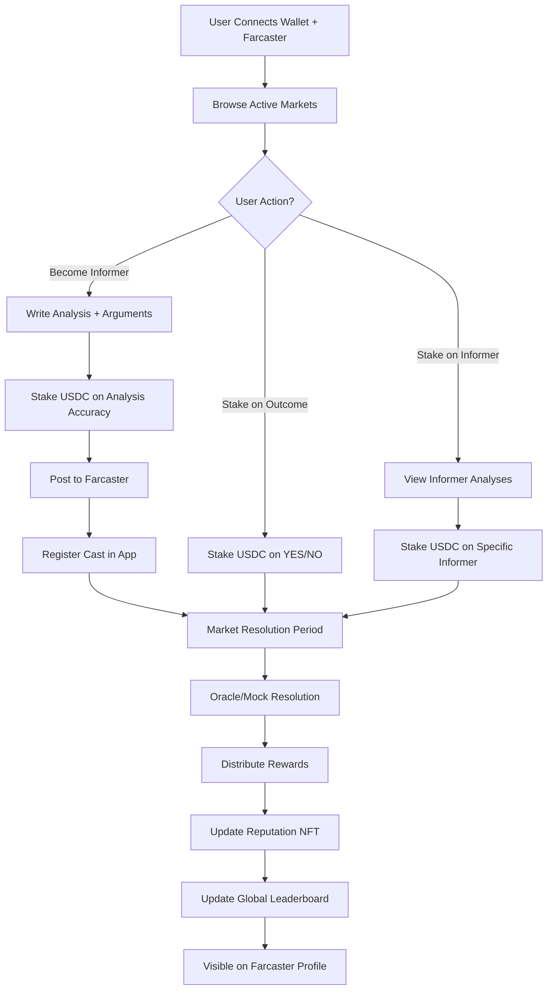
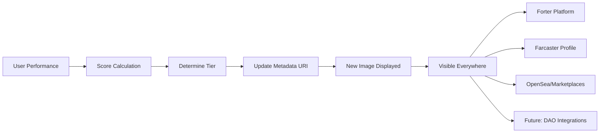

# Forter - Finance for Truth

## Executive Summary
Forter adalah **Information Finance Protocol** - platform Web3 yang mengubah informasi kredibel menjadi aset finansial. Kami bukan prediction market untuk gambling - kami adalah infrastruktur untuk memverifikasi, memonetisasi, dan membangun reputasi berbasis analisis yang akurat.

**Tagline**: "Stake on Credibility, Not Luck"

**Core Innovation**: Dual-staking mechanism yang memungkinkan users untuk:
1. Stake pada outcome (YES/NO) - traditional prediction
2. Stake pada specific informer - backing analyst credibility

Platform ini lahir dari konsep "Forecast Porter" - di mana para analis menjadi "porter" yang membawa wawasan berharga, sementara platform menjadi "gatekeeper" yang menjaga kredibilitas informasi.

## Table of Contents
1. [Problem Statement](#problem-statement)
2. [Solution Overview](#solution-overview)
3. [Our Unique Value Proposition](#our-unique-value-proposition)
4. [How It Works](#how-it-works)
5. [Dynamic Reputation NFT System](#dynamic-reputation-nft-system)
6. [Technical Architecture](#technical-architecture)
7. [Tokenomics & Incentives](#tokenomics-incentives)
8. [Development Roadmap](#development-roadmap)
9. [Setup Instructions](#setup-instructions)
10. [Testing Strategy](#testing-strategy)
11. [Demo Scenarios](#demo-scenarios)

## Problem Statement

### Current Market Problems
- **Information Overload**: Di era digital, kita dibanjiri informasi tapi sulit membedakan signal dari noise
- **No Skin in the Game**: Analis dan influencer membuat prediksi tanpa konsekuensi jika salah
- **Pure Speculation Focus**: Platform prediction market existing seperti Polymarket fokus pada betting, bukan knowledge discovery
- **No Permanent Track Record**: Tidak ada sistem reputasi on-chain yang permanen untuk mengukur kredibilitas
- **Monetization Gap**: Analyst yang bagus tapi belum punya audience besar kesulitan monetize keahlian mereka

### Our Target Users
1. **Retail Investors & Decision Makers**: Butuh sumber analisis terpercaya
2. **Emerging Professional Analysts**: Ingin build verifiable reputation dan monetize accuracy (bukan just followers)
3. **Communities & DAOs**: Perlu collective intelligence untuk keputusan strategis
4. **Information Consumers**: Yang ingin access credible insights tanpa subscription friction

## Solution Overview

### The Forter Philosophy
Forter menggabungkan dua konsep kunci:
- **Forecast**: Proyeksi berbasis data dan analisis, bukan tebakan
- **Porter**: Pembawa wawasan sekaligus penjaga kredibilitas

**We are NOT a gambling platform.** We are an **information finance protocol** - turning credible analysis into yield-bearing assets.

### Information Finance vs Prediction Markets

| Aspect | Traditional Prediction Market | Forter (Information Finance) |
|--------|------------------------------|------------------------------|
| **Purpose** | Bet on outcomes | Fund credible analysis |
| **Incentive** | Win bets | Earn yield on verified insights |
| **Users** | Speculators | Analysts, researchers, informed investors |
| **Token Flow** | Gambling-style pools | Research-based staking |
| **Core Value** | Entertainment + speculation | Knowledge discovery + accountability |
| **Resolution** | Outcome only | Outcome + analyst credibility |

### Core Features

```
┌─────────────────────────────────────────────────┐
│                   FORTER MVP                     │
├─────────────────────────────────────────────────┤
│                                                  │
│  1. Market Discovery    2. Analysis Submission   │
│     Browse Markets         Write Reasoning       │
│     Filter by Category     Stake on Analysis     │
│     View Past Performance  Post to Farcaster     │
│                                                  │
│  3. Dual Staking        4. Resolution           │
│     Stake on Outcome       Oracle Verification  │
│     Stake on Informer      Reward Distribution  │
│     View Staking Pools     Update Reputation    │
│                                                  │
│  5. Dynamic Reputation System                   │
│     Soulbound NFT Updates (Image Changes!)      │
│     Global Leaderboard                          │
│     Category-Specific Rankings                  │
└─────────────────────────────────────────────────┘
```

## Our Unique Value Proposition

### 🎯 Forter's USP: "Finance for Truth"

**One-liner:** Forter transforms information into a financial asset — enabling people to stake, verify, and earn from credible insights, not speculation.

### The 5 Pillars of Forter's Differentiation

#### 1. 💎 Dual-Staking Credibility Model
Unlike Polymarket or other prediction platforms that only let users stake on outcomes, Forter introduces **dual staking**:
- Users stake on **informers (analysts)** to signal trust
- Informers stake on **their own analysis** to prove conviction

✅ **Result**: Incentivizes truth and expertise, not lucky guesses
❌ **Prevents**: Reckless predictions and information spam

#### 2. 🧠 Information-as-a-Financial-Primitive
Forter makes information **financeable** — analysts can tokenize their credibility and earn yield based on verified accuracy.
- Each analysis becomes an **on-chain financial position**
- Credibility = measurable performance, not social hype
- Creates a new asset class: **Credibility Yield Instruments**

**Example:** An analyst with 85% accuracy becomes a "yield-bearing asset" that others can stake on.

#### 3. 🔗 On-Chain Reputation & Accountability
Every analyst builds a **permanent, verifiable track record** on-chain via **Dynamic Soulbound NFTs (SBTs)**:
- Reputation stored immutably
- Transparent accuracy stats
- Historical performance per topic (crypto, macro, tech, etc.)
- **NFT image updates dynamically** based on performance tiers

**No more "trust me bro"** — credibility becomes quantifiable and portable.

#### 4. ⚖️ Data-Verified Truth Resolution
Resolutions aren't based on subjective votes, but on **verifiable data sources** via oracles & AI agents:
- Oracle + AI verification = fewer disputes, higher credibility
- Integrates public data (economic indicators, price feeds, news APIs)
- Bridges DeFi logic (verifiable outcomes) with research logic (verifiable sources)

#### 5. 🧭 Bridging Analysts, Investors, and DAOs
Forter connects **people who know** (analysts) with **people who decide** (investors, DAOs, funds):
- Investors get access to trustworthy, crowd-verified insights
- Analysts get paid for **proven accuracy**, not follower count
- DAOs can use Forter for **more credible collective decisions**

**In essence:** Forter = Bloomberg + Polymarket + Farcaster reputation graph hybrid

---

### Why Would Informers Use Forter?

**The Critical Question:** *"If analysts already have their own audience and can charge $100/signal, why risk money on Forter?"*

#### The Honest Answer:

1. **On-chain Proof of Credibility**
   - Your track record isn't a screenshot — it's cryptographically proven
   - Build **immutable reputation capital**, not just social clout
   - Portable across ecosystems (future: DeFi credit scores, DAO governance)

2. **Passive Yield from Reputation**
   - Once you build verified performance, **Informer Stakers** fund your future predictions
   - Your reputation becomes a **yield-bearing asset**
   - Earn even when you stop actively predicting

3. **No Subscription Friction**
   - Don't need to chase subscribers or manage payments
   - Protocol rewards + staking yield scales infinitely
   - One good prediction can reward from hundreds of stakers

4. **Early Adopter Advantage**
   - Early informers' NFTs become historically valuable
   - Similar to early Polymarket traders or Nansen OGs
   - Genesis Informer Collection potential

5. **Risk-Adjustable Participation**
   - Low stake for credibility-only participation
   - High stake for bigger yield + reputation gain
   - You're not forced to bet big

**Target Segment:** We're not targeting top-tier analysts first. We're targeting **emerging credible analysts** (crypto, macro, AI) who want to build **verifiable credibility** and monetize accuracy, not just followers.

## How It Works

### User Journey Flow



### User Roles

**1. Informers (The Porters)**
- Submit analysis dengan reasoning yang jelas
- Stake USDC pada akurasi analisis mereka
- Build on-chain reputation over time
- Earn 70% dari reward pool jika terbukti akurat

**2. Stakers** 
- Dapat stake pada outcome (YES/NO)
- Dapat stake pada specific informer yang dipercaya
- Earn rewards proportional dengan stake mereka

**3. Readers**
- Browse analisis tanpa perlu stake
- Follow top informers di Farcaster
- Use platform sebagai research tool

### Market Lifecycle

#### Phase 1: Market Creation (Day 0)
- Admin creates curated markets (MVP)
- Set parameters: duration, min stake, category
- Markets fokus pada verifiable outcomes

#### Phase 2: Analysis Period (Day 1-12)
- Informers submit analisis dengan evidence
- Minimum stake requirement untuk filter spam
- Analisis harus include reasoning (wajib)
- Auto-post ke Farcaster untuk visibility

#### Phase 3: Staking Period (Day 1-13)
- Users stake pada outcomes atau informers
- Quadratic staking untuk influence calculation
- Real-time pool updates

#### Phase 4: Resolution (Day 14)
- Mock oracle untuk MVP demo
- Future: Chainlink/UMA integration
- 24-hour challenge period

#### Phase 5: Settlement
- Platform fee 2% untuk sustainability
- 70% rewards ke informer ecosystem
- 30% rewards ke outcome stakers
- Reputation NFT updates

### Reputation System (Overview)

**Soulbound NFT Components:**
- Overall accuracy percentage
- Total markets participated
- Category-specific expertise
- Streak indicators
- Trust badges

**Calculation Method (MVP):**
- Simple accuracy: (Correct/Total) × 100%
- Future: ELO-based system untuk complexity weighting

*For detailed technical implementation of Dynamic NFTs, see the [Dynamic Reputation NFT System](#dynamic-reputation-nft-system) section below.*

## Dynamic Reputation NFT System

### 🖼️ What Makes Our NFTs "Dynamic"?

Unlike static NFT profile pictures, **Forter's Reputation NFTs update their visual appearance and metadata automatically** based on the user's performance and credibility score.

### Core Concept

Each informer receives a **Soulbound Token (SBT)** that:
- **Cannot be transferred** (tied to their wallet/identity)
- **Updates its image** based on accuracy tiers
- **Updates metadata** after each market resolution
- Acts as a **portable reputation passport** across Web3

### How Dynamic NFTs Work



### NFT Tier System

Performance tiers determine which image is displayed:

| Tier | Accuracy Range | Image/Badge | Additional Benefits |
|------|---------------|-------------|---------------------|
| **Novice** | 0-49% | 🥉 Bronze Badge | Basic access |
| **Analyst** | 50-69% | 🥈 Silver Badge | Standard visibility |
| **Expert** | 70-84% | 🥇 Gold Badge | Featured in leaderboard |
| **Master** | 85-94% | 💎 Diamond Badge | Priority display, higher staking multiplier |
| **Legend** | 95-100% | 👑 Crown Badge | Exclusive benefits, DAO governance rights |

### Metadata Structure

The NFT metadata (stored on IPFS) updates to reflect:

```json
{
  "name": "Forter Reputation #1234",
  "description": "On-chain credibility certificate for analyst 0x1234...",
  "image": "ipfs://QmXXX/tier-diamond.png",
  "attributes": [
    {
      "trait_type": "Accuracy",
      "value": 87.5,
      "display_type": "percentage"
    },
    {
      "trait_type": "Markets Participated",
      "value": 42
    },
    {
      "trait_type": "Tier",
      "value": "Master"
    },
    {
      "trait_type": "Specialty",
      "value": "Macroeconomics"
    },
    {
      "trait_type": "Current Streak",
      "value": 8
    },
    {
      "trait_type": "Total Rewards Earned",
      "value": "1250 USDC"
    }
  ]
}
```

### Technical Implementation

#### 1. Smart Contract Architecture

**ReputationSBT.sol:**
```solidity
// Core functions
function updateReputation(address user, bool wasCorrect) external onlyMarketContract
function getReputationData(address user) external view returns (ReputationData)
function tokenURI(uint256 tokenId) external view returns (string memory)
```

The `tokenURI` function returns a **dynamic metadata URL** that changes based on the user's current stats.

#### 2. Metadata Update Flow

```
Market Resolves
  → Smart contract calls updateReputation()
  → Backend API generates new metadata
  → Upload to IPFS (new hash)
  → Update tokenURI in contract
  → NFT marketplaces auto-refresh
```

#### 3. Backend API Endpoint

```javascript
// POST /api/nft/update-metadata
{
  "wallet": "0x1234...",
  "newAccuracy": 87.5,
  "totalMarkets": 42,
  "tier": "Master"
}

// Returns: { ipfsHash: "QmNewHash...", imageUrl: "ipfs://..." }
```

### Visual Examples

**Progression Path:**

```
🥉 Novice (30% accuracy)
    ↓ (User improves)
🥈 Analyst (65% accuracy)
    ↓ (Consistent wins)
🥇 Expert (78% accuracy)
    ↓ (Near-perfect streak)
💎 Master (91% accuracy)
    ↓ (Perfect performance)
👑 Legend (98% accuracy)
```

Each tier has a unique visual design reflecting credibility level.

### Why This Matters

#### For Informers:
- **Visual proof** of credibility that's instantly recognizable
- **Gamification** encourages consistent high performance
- **Portable reputation** usable across platforms

#### For Stakers:
- **Quick assessment** of informer quality (just look at their badge)
- **Trust signals** reduce due diligence time
- **Historical verification** via on-chain metadata

#### For the Ecosystem:
- **Reputation becomes composable** (other dApps can read it)
- **Sybil resistance** (can't fake on-chain performance)
- **Network effects** (the more integrations, the more valuable the NFT)

### Future Enhancements

**Phase 2+:**
- **Category-specific badges** (Economics Expert, Crypto Master, etc.)
- **Special edition NFTs** for perfect streaks or tournament wins
- **Animated NFTs** where performance affects animation speed/style
- **Collaborative NFTs** for team predictions
- **Achievement unlocks** (participated in 100 markets, etc.)

### NFT Value Proposition (Realistic)

**What the NFT IS:**
- An **identity and credibility record**
- A **functional utility token** (unlocks features, governance)
- A **reputation primitive** (other protocols can integrate it)

**What the NFT is NOT:**
- NOT a tradable collectible (it's soulbound)
- NOT speculative (value = utility + reputation, not hype)
- NOT a "profile picture project"

**Real Value Comes From:**
- Network adoption (more platforms recognize Forter reputation)
- Ecosystem integration (DeFi protocols use it for credit scoring, DAOs for governance)
- Professional signaling (analysts showcase it as proof of expertise)

## Technical Architecture

### System Overview

```
┌─────────────────────────────────────────────────────┐
│                   User Interface                      │
│                                                      │
│   Next.js + Tailwind + RainbowKit + Wagmi          │
└─────────────────────────────────────────────────────┘
                          │
                          ▼
┌─────────────────────────────────────────────────────┐
│                  Backend Services                    │
│                                                      │
│   API Server │ Farcaster Integration │ Database     │
│   (Node.js)  │ (Neynar API)         │ (PostgreSQL) │
└─────────────────────────────────────────────────────┘
                          │
                          ▼
┌─────────────────────────────────────────────────────┐
│                 Base Network (L2)                    │
│                                                      │
│   Market Contract │ Staking Contract │ SBT Contract │
└─────────────────────────────────────────────────────┘
```

### Key Components

**Frontend Layer:**
- Next.js 14 dengan App Router
- Responsive design untuk mobile-first
- Real-time updates via websockets
- Farcaster frame support

**Backend Services:**
- RESTful API untuk data operations
- Farcaster hub integration untuk social features
- PostgreSQL untuk off-chain data
- Redis untuk caching dan sessions

**Smart Contracts:**
- Market Factory: Deploy dan manage markets
- Staking Pool: Handle dual-staking mechanism
- Reputation SBT: Non-transferable reputation tokens
- Treasury: Platform fee collection

**External Integrations:**
- Farcaster (via Neynar): Identity dan social graph
- IPFS (via Pinata): NFT metadata storage
- Oracle (future): Chainlink/UMA untuk resolution

## Tokenomics & Incentives

### Token Usage
- **Staking Token**: USDC on Base network
- **No Platform Token**: Fokus pada utility, bukan speculation

### Fee Structure
- Platform Fee: 2% dari total pool
- Minimum Stake: $0.5 USDC (testnet) / $5 USDC (mainnet)
- No withdrawal fees

### Reward Distribution

```
Total Pool (100%)
    │
    ├── Platform Fee (2%)
    │
    └── Reward Pool (98%)
         │
         ├── Informer Ecosystem (70%)
         │    ├── Correct Informers (50%)
         │    └── Informer Stakers (20%)
         │
         └── Outcome Stakers (30%)
```

#### Understanding the 3 Types of Stakers

| Type | Who They Are | What They Stake On | Reward Pool | Philosophy |
|------|--------------|-------------------|-------------|-----------|
| **Informer** | Analyst/creator | Their own analysis | 50% | Reward for accurate knowledge creation |
| **Informer Staker** | Supporter/backer | Specific informer's credibility | 20% | Reward for identifying trustworthy analysts |
| **Outcome Staker** | General participant | YES/NO outcome directly | 30% | Reward for market liquidity & participation |

**Key Difference Between Informer Stakers vs Outcome Stakers:**

- **Informer Stakers (20%)**:
  - You believe **Alice is a consistently accurate analyst**
  - You stake 10 USDC **on Alice's analysis** (not on YES/NO)
  - If Alice's prediction is correct → you earn from the 20% pool
  - 💡 Think: "Backing good fund managers"

- **Outcome Stakers (30%)**:
  - You believe **the outcome will be YES**
  - You stake 10 USDC **on YES** (regardless of who predicted it)
  - If the market resolves TRUE → you earn from the 30% pool
  - 💡 Think: "Market sentiment staking"

**Why This Split Matters:**
- Balances speculation with credibility
- Gives weight to human intelligence (informer system) while still letting market's collective intelligence play a role
- Prevents "whales" from dominating purely through betting power — **informer quality drives most rewards**

### Anti-Gaming Mechanisms
- Farcaster ID age >30 days
- Minimum 10 casts requirement
- Quadratic staking untuk influence
- Rate limiting per address

## Development Roadmap

### Phase 0: MVP (Hackathon - December 2024)
- ✅ Core smart contracts
- ✅ Basic UI dengan market browsing
- ✅ Farcaster authentication
- ✅ Mock oracle resolution
- ✅ 8 curated demo markets

### Phase 1: Testnet Launch (Q1 2025)
- Live testnet deployment on Base Sepolia
- Neynar API integration
- Real user testing dengan testnet USDC
- Basic analytics dashboard

### Phase 2: Mainnet Beta (Q2 2025)
- Mainnet deployment dengan limited markets
- AI news aggregator untuk semi-automated resolution
- Enhanced reputation system
- Mobile-responsive design

### Phase 3: Scale (Q3-Q4 2025)
- Chainlink oracle integration
- Community-created markets
- Advanced analytics dan API
- Cross-chain expansion plans

## Setup Instructions

### Prerequisites
- Node.js 20+ 
- PostgreSQL 14+
- Redis 6+
- Farcaster account
- Base network wallet

### Environment Variables
```bash
# Backend
DATABASE_URL=
REDIS_URL=
NEYNAR_API_KEY=
BASE_RPC_URL=

# Frontend
NEXT_PUBLIC_WALLET_CONNECT_ID=
NEXT_PUBLIC_BASE_RPC_URL=
NEXT_PUBLIC_API_URL=

# Contracts
DEPLOYER_PRIVATE_KEY=
ETHERSCAN_API_KEY=
```

### Local Development Setup
1. Clone repository
2. Install dependencies untuk semua packages
3. Setup database dengan migrations
4. Deploy contracts ke local network
5. Start backend services
6. Start frontend development server

## Testing Strategy

### Smart Contract Testing
- Unit tests untuk setiap fungsi
- Integration tests untuk full user flows
- Gas optimization tests
- Security audit preparation

### Backend Testing
- API endpoint tests
- Farcaster integration mocks
- Database transaction tests
- Load testing untuk scaling

### Frontend Testing
- Component unit tests
- E2E tests untuk critical paths
- Wallet connection tests
- Mobile responsiveness tests

## Demo Scenarios

### Scenario 1: First-Time Informer
1. Alice connects wallet dan Farcaster
2. Browses market "Will Bank Indonesia cut rates?"
3. Writes detailed analysis dengan 3 evidence links
4. Stakes 5 USDC pada analisisnya
5. Post otomatis ke Farcaster
6. Market resolves - Alice benar
7. Alice earns rewards + reputation boost

### Scenario 2: Strategic Staker
1. Bob melihat multiple analyses
2. Checks historical accuracy dari informers
3. Stakes 10 USDC pada informer dengan 85% accuracy
4. Market resolves sesuai prediksi informer
5. Bob earns proportional rewards

### Scenario 3: Reputation Building
1. Carol consistently memberikan analisis akurat
2. Reputation NFT shows 90% accuracy over 20 markets
3. Becomes top informer di kategori "Economics"
4. Gains followers di Farcaster
5. Higher trust = more stakers = more rewards

## Conclusion

Forter bukan sekadar prediction market. Ini adalah **Information Finance Protocol** - infrastruktur untuk membangun "trust layer" di era informasi. Dengan menggabungkan incentive finansial dan reputasi permanen on-chain, Forter menciptakan ekosistem di mana kebenaran dan kredibilitas memiliki nilai nyata.

### Our Core Beliefs

1. **Information should be a financial asset** - Not clickbait, not speculation, but verifiable insight with real yield
2. **Credibility should be measurable** - On-chain, transparent, and portable across ecosystems
3. **Analysts deserve fair compensation** - Based on accuracy, not follower count
4. **Truth has value** - And we're building the infrastructure to prove it

### Our Mission

**Transform noise into signal, speculation into analysis, dan anonymity into accountability.**

### What Makes Us Different

We're not building:
- ❌ A gambling platform disguised as predictions
- ❌ A social media for hot takes
- ❌ Another token speculation game

We're building:
- ✅ A reputation layer for credible information
- ✅ A financial system for knowledge workers
- ✅ A trust infrastructure for Web3 decision-making

### The Vision: "Finance for Truth"

Imagine a world where:
- DAOs use Forter reputation scores for governance weights
- DeFi protocols check Forter SBTs for credit scoring
- Research funds stake on emerging analysts via Forter
- News platforms integrate Forter credibility badges
- Investment firms source alpha from verified Forter analysts

**That's the future we're building.**

Forter is not just a product - it's a **primitive** for the information economy.

---

### Get Involved

- **For Developers**: Check `/docs` for technical implementation details
- **For Analysts**: Join our early informer program (testnet launching Q1 2025)
- **For Investors**: Read our tokenomics and growth strategy
- **For Partners**: Integrate Forter's reputation layer into your protocol

**Contact**: [Your contact info here]
**Website**: [Your website]
**Twitter**: [Your Twitter]
**Farcaster**: [Your Farcaster]

---

*"In a world flooded with noise, credibility is the new currency. Forter makes it liquid."*