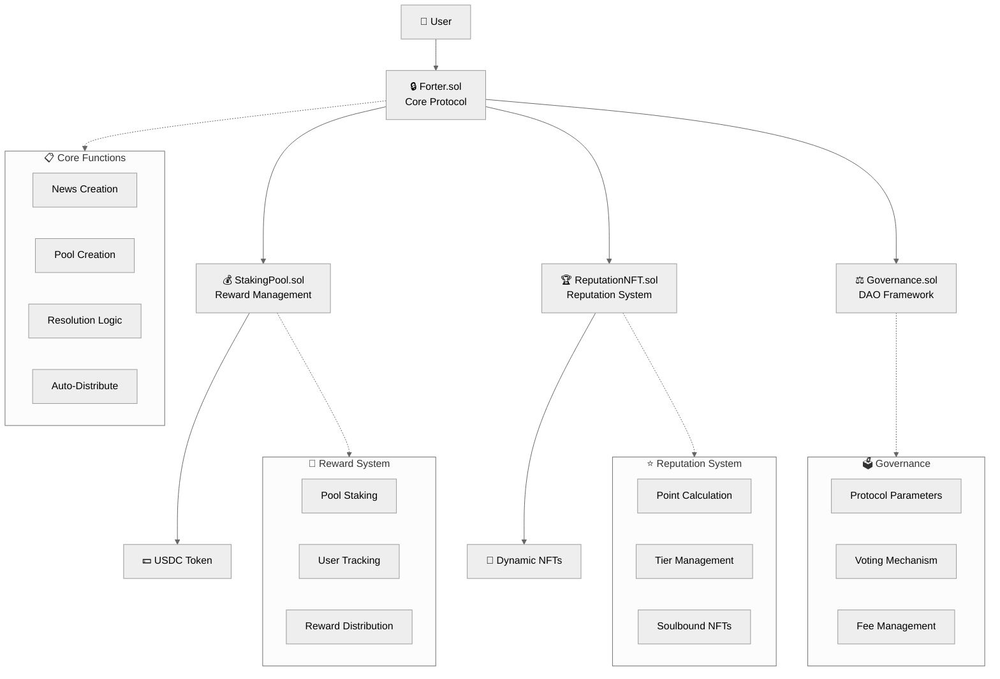
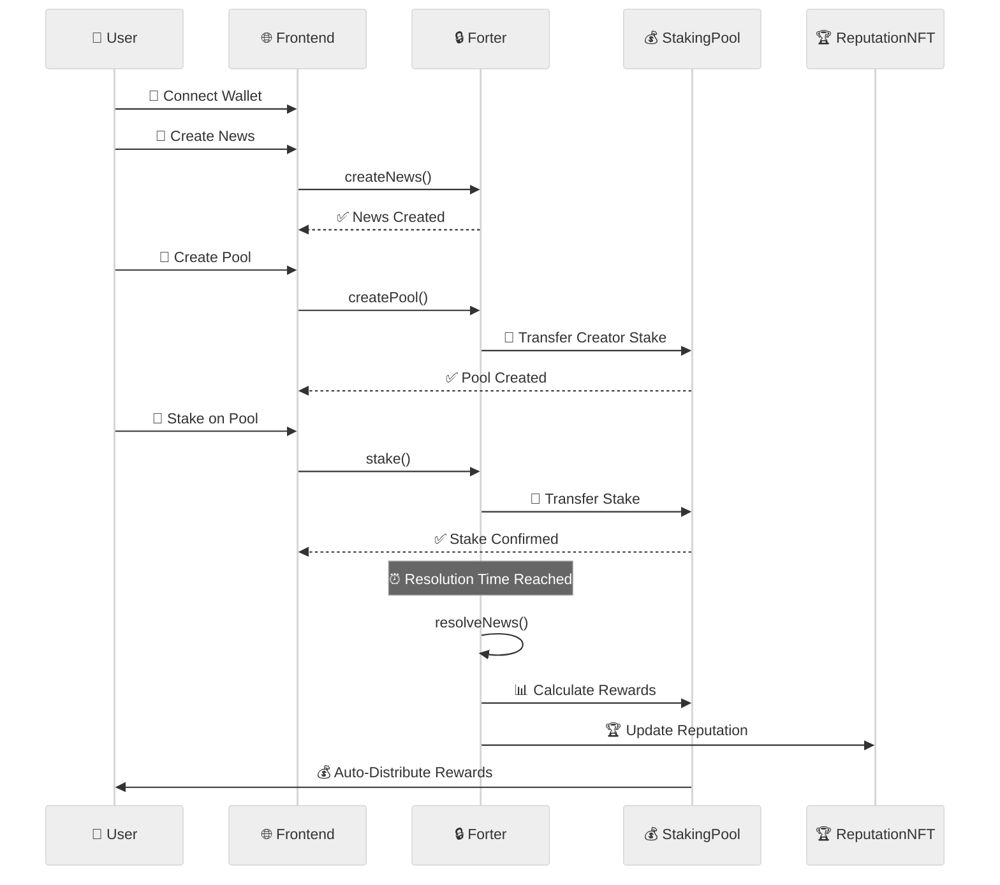

# Forter - Information Finance Protocol

<a href="https://forter-news.vercel.app/" target="_blank"></a>
<a href="https://farcaster.xyz/miniapps/gM4PKvjzcF47/forter" target="_blank"></a>
<a href="https://www.youtube.com/watch?v=Dxlh9GIQCZM" target="_blank"></a>
<a href="https://devfolio.co/projects/forter-news-33aa" target="_blank"></a>
<a href="https://www.canva.com/design/DAG2DT4E5pw/CndHiIzlbRZwgaPH-iOHnw/view?utm_content=DAG2DT4E5pw&utm_campaign=designshare&utm_medium=link2&utm_source=uniquelinks&utlId=h99613be7e9" target="_blank"></a>

---

## Overview

Forter is an **Information Finance Protocol** that transforms credible information into financial assets through permissionless prediction markets. Unlike traditional betting platforms, we enable users to fund quality analysis and build verifiable on-chain reputation.

**Core Innovation**: Permissionless News + Independent Pools

1. **Anyone can create NEWS** - Permissionless predictions with clear resolution criteria
2. **Anyone can create POOL** - Independent analysis with reasoning and separate stake pools
3. **Stake on specific pools** - Back credible reasoning, not just outcomes

**Tagline**: "Stake on Credibility, Not Luck"

---

## Base Batches 002 Submission

Forter is participating in **Base Batches 002 Builder Track** with a fully functional information finance protocol built on Base network.

### Requirements Compliance

| Requirement                 | Status | Details                                                                                                     |
| --------------------------- | ------ | ----------------------------------------------------------------------------------------------------------- |
| **Built on Base**           | ✅     | Deployed on Base Sepolia with verified contracts                                                            |
| **Functioning Onchain App** | ✅     | Full news, pools, staking, and rewards system                                                               |
| **Open Source**             | ✅     | Complete codebase available on GitHub                                                                       |
| **Live Demo**               | ✅     | Working application at <a href="https://forter-news.vercel.app/" target="_blank">forter-news.vercel.app</a> |
| **Testnet Transactions**    | ✅     | Multiple live staking transactions on Base Sepolia                                                          |
| **Demo Video**              | ✅     | 6-minute comprehensive <a href="https://www.youtube.com/watch?v=Dxlh9GIQCZM" target="_blank">demo</a>       |
| **Basenames Ready**         | ✅     | Integration ready for Base Account                                                                          |

### Key Differentiators

- **Independent Pool Architecture**: Multiple analysis pools per news item (unique in prediction markets)
- **Auto-Distribute Rewards**: 20/80 creator/staker split with automatic distribution
- **Dynamic Reputation NFTs**: Soulbound tokens that update based on performance
- **Information Finance**: Transform analysis into yield-generating assets, not gambling
- **Base Native**: Built for Base ecosystem with Farcaster MiniApp integration

---

## Deployed Contracts

**Network**: Base Sepolia Testnet | **Deploy Date**: October 23, 2025

| Contract          | Address                                                                                                                                                         | Purpose                         |
| ----------------- | --------------------------------------------------------------------------------------------------------------------------------------------------------------- | ------------------------------- |
| **Forter (Main)** | <a href="https://base-sepolia.blockscout.com/address/0x5ae223B8128fc8Dc4FE343b191143982cf649cCC" target="_blank">0x5ae223B8128fc8Dc4FE343b191143982cf649cCC</a> | Core protocol contract          |
| **StakingPool**   | <a href="https://base-sepolia.blockscout.com/address/0x2308ad08C67EE0110ECDC1d9d625eE862994d17C" target="_blank">0x2308ad08C67EE0110ECDC1d9d625eE862994d17C</a> | Pool staking & rewards          |
| **ReputationNFT** | <a href="https://base-sepolia.blockscout.com/address/0x093c645Cf139c064881709b442Fa57980A5E1d01" target="_blank">0x093c645Cf139c064881709b442Fa57980A5E1d01</a> | Soulbound NFT for reputation    |
| **Governance**    | <a href="https://base-sepolia.blockscout.com/address/0xE5475235b7406612a97Cc561504716E6902c6271" target="_blank">0xE5475235b7406612a97Cc561504716E6902c6271</a> | DAO governance contract         |
| **USDC Mock**     | <a href="https://base-sepolia.blockscout.com/address/0xc6260DE79F989dF47694c09b5a8f558e9208ae99" target="_blank">0xc6260DE79F989dF47694c09b5a8f558e9208ae99</a> | Testnet USDC token (6 decimals) |

---

## How It Works

### Architecture Overview

```
┌─────────────────────────────────────────┐
│ NEWS (User-created, permissionless)     │
│ "ETH will reach $5000 this December"    │
│ Resolution: Dec 31, 2025                │
│ Creator: @alice                         │
└─────────────────────────────────────────┘
              ↓
    ┌─────────────────┐
    │ Multiple POOLS  │ (Independent)
    └─────────────────┘
              ↓
┌──────────────────────────────────────────┐
│ POOL 1 by @bob                           │
│ Position: YES                            │
│ Reasoning: "I agree due to ETF approval" │
│                                          │
│ Stakes:                                  │
│ - Agree: $1000 (10 users)                │
│ - Disagree: $200 (3 users)               │
│                                          │
│ Resolution: Same as NEWS (Dec 31)        │
│ If ETH ≥ $5000 → "Agree" wins            │
└──────────────────────────────────────────┘
```

### User Flow

1. **Create NEWS** → 2. **Create POOL** (reasoning + stake) → 3. **Stake** (Agree/Disagree) → 4. **Resolution** (admin verification) → 5. **Auto-Distribute Rewards** (20% creator / 80% stakers)

### vs Traditional Prediction Markets

| Feature            | Traditional     | Forter                               |
| ------------------ | --------------- | ------------------------------------ |
| **Pool Structure** | 1 shared pool   | Multiple independent pools           |
| **Focus**          | Bet on outcomes | Fund credible analysis               |
| **Value**          | Speculation     | Knowledge discovery + accountability |

---

## Tokenomics & Incentives

### Reward Distribution

```
Single Pool Total Stakes (100%)
    │
    ├── Platform Fee (2%)
    │
    └── Reward Pool (98%)
         │
         ├── Pool Creator (20% of remaining) ✨ AUTO-DISTRIBUTED
         │    └── If pool position CORRECT
         │    └─ Creator is EXCLUDED from staker pool
         │
         └─ Winning Stakers (80% of remaining) ✨ AUTO-DISTRIBUTED
              ├── "Agree" stakers (if pool correct)
              └─ OR "Disagree" stakers (if pool wrong)
```

### Fee Structure

| Parameter         | Value                                   |
| ----------------- | --------------------------------------- |
| **Platform Fee**  | 2% of total pool                        |
| **Minimum Stake** | $0.5 USDC (testnet) / $5 USDC (mainnet) |
| **Staking Token** | USDC (6 decimals)                       |
| **Withdrawal**    | Free                                    |

**Key Features**: Creator gets 20% when correct, Stakers get 80%, Auto-distribute rewards, No double-dipping

---

## Reputation System

### Reputation Tiers

| Tier        | Points Required | Min Pools | Badge | Benefits                |
| ----------- | --------------- | --------- | ----- | ----------------------- |
| **Novice**  | 0-199           | 0         | 🥉    | Basic access            |
| **Analyst** | 200-499         | 0         | 🥈    | Standard visibility     |
| **Expert**  | 500-999         | 5+        | 🥇    | Featured in leaderboard |
| **Master**  | 1,000-4,999     | 10+       | 💎    | Priority display        |
| **Legend**  | 5,000+          | 20+       | 👑    | Elite status            |

### Point Calculation

```
Total Reputation Points = Σ (Pool Points × Stake Multiplier)

Pool Points:
├─ Correct prediction: +100 points
└─ Wrong prediction: -30 points

Stake Multiplier (based on pool total stake):
├─ < $100:        1.0x (no bonus)
├─ $100-$499:     1.5x (small pool bonus)
├─ $500-$999:     2.0x (medium pool bonus)
├─ $1,000-$4,999: 2.5x (large pool bonus)
└─ $5,000+:       3.0x (whale pool bonus)
```

**NFT Features**: Soulbound (non-transferable), Dynamic metadata, Tier-based visual badges, Portable across Web3

---

## Technical Architecture

### Smart Contract Architecture



### User Flow Architecture



### Technology Stack

**Smart Contracts**: Solidity 0.8.20, Foundry, OpenZeppelin <br>
**Frontend**: Next.js 15, TypeScript, Tailwind CSS, RainbowKit + Wagmi, Privy <br>
**Web3**: OnchainKit, MiniKit, Viem, Farcaster SDK <br>
**Future**: Envio Indexer, Neynar API, Chainlink Oracle

---

## Development Roadmap

| Phase                   | Timeline        | Status      | Key Objectives                                                         |
| ----------------------- | --------------- | ----------- | ---------------------------------------------------------------------- |
| **Phase 1: Testnet**    | Oct 11-25, 2025 | ✅ Complete | Core contracts, Frontend, Farcaster MiniApp, 85% functionality         |
| **Phase 2: Mainnet**    | Q1 2026         | 🔄 Next     | Mainnet launch, Chainlink oracle, Enhanced UI, Base partnerships       |
| **Phase 3: Expansion**  | Q2 2026         | 📋 Planned  | Analytics platform, Mobile app, Public API, Cross-chain                |
| **Phase 4: Leadership** | Q3-Q4 2026      | 📋 Planned  | DAO governance, Advanced markets, AI tools, L2 scaling                 |
| **Phase 5: Global**     | 2027+           | 📋 Vision   | Multi-language, Compliance, Traditional markets, Academic partnerships |

---

## Team

**Forter is built by a passionate team of Web3 builders:**

| Name       | Role                 | Focus                                       |
| ---------- | -------------------- | ------------------------------------------- |
| **Luthfi** | Lead Developer       | Smart Contracts, Full-Stack, DeFi protocols |
| **Tachul** | Frontend Developer   | React, Web3 Integration, UX optimization    |
| **Cliff**  | Business Strategy    | Product Design, Tokenomics, Go-to-market    |
| **Zidan**  | Business Development | Partnerships, Ecosystem growth, Community   |

---

## Quick Start

**Try Live**: <a href="https://forter-news.vercel.app/" target="_blank">forter-news.vercel.app</a> → Connect wallet → Switch to Base Sepolia → Get <a href="https://console.optimism.io/faucet" target="_blank">testnet USDC</a> → Mint <a href="https://base-sepolia.blockscout.com/address/0xc6260DE79F989dF47694c09b5a8f558e9208ae99?tab=write_contract" target="_blank">Forter USDC Mock</a> → Create & stake

**Local Dev**:

```bash
git clone https://github.com/luthfidi/forter-news && cd forter-news
pnpm install
cp frontend/.env.example frontend/.env.local  # Add contract addresses
cd frontend && pnpm dev
```

---

## Resources

### Live Links

- **Main App**: <a href="https://forter-news.vercel.app/" target="_blank">forter-news.vercel.app</a>
- **Farcaster MiniApp**: <a href="https://farcaster.xyz/miniapps/gM4PKvjzcF47/forter" target="_blank">forter</a>
- **Demo Video**: <a href="https://www.youtube.com/watch?v=Dxlh9GIQCZM" target="_blank">Watch on YouTube</a>
- **Presentation**: <a href="https://www.canva.com/design/DAG2DT4E5pw/CndHiIzlbRZwgaPH-iOHnw/view?utm_content=DAG2DT4E5pw&utm_campaign=designshare&utm_medium=link2&utm_source=uniquelinks&utlId=h99613be7e9" target="_blank">Canva Design</a>
- **Devfolio Submission**: <a href="https://devfolio.co/projects/forter-news-33aa" target="_blank">devfolio.co/projects/forter-news-33aa</a>

### Technical Resources

- **GitHub Repository**: <a href="https://github.com/luthfidi/forter-news" target="_blank">github.com/luthfidi/forter-news</a>
- **Base Sepolia Explorer**: <a href="https://base-sepolia.blockscout.com/address/0x5ae223B8128fc8Dc4FE343b191143982cf649cCC" target="_blank">View Contracts</a>
- **Contract Verification**: All contracts verified on Blockscout
- **Documentation**: Complete contract and API documentation in repository

---

## Vision

**Transform noise into signal, speculation into analysis, and anonymity into accountability.**

_Forter is not just a product - it's a permissionless primitive for the information economy, built on Base._

---

**🎯 Ready for Base Batches 002 evaluation. Let's build the future of information finance together!**
