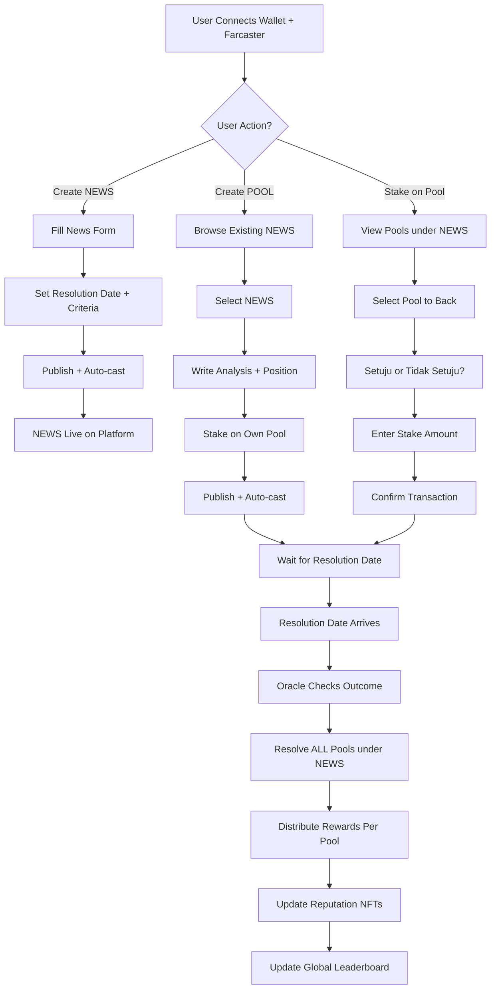
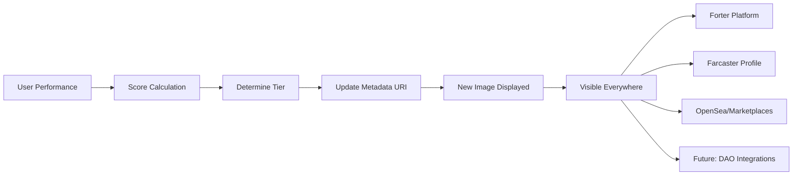

# Forter - Farcaster Porter

## Executive Summary
Forter adalah **Information Finance Protocol** - platform Web3 yang mengubah informasi kredibel menjadi aset finansial. Kami bukan prediction market untuk gambling - kami adalah infrastruktur **permissionless** untuk memverifikasi, memonetisasi, dan membangun reputasi berbasis analisis yang akurat.

**Tagline**: "Stake on Credibility, Not Luck"

**Core Innovation**: Permissionless News + Independent Pool mechanism:
1. **Anyone can create NEWS** - Prediksi/statement dengan timeline jelas (permissionless)
2. **Anyone can create POOL** - Analisis dengan reasoning + own stake pool per news
3. **Stake on specific pool** - Back reasoning yang paling kredibel (Setuju/Tidak Setuju)

**Key Difference from Traditional Markets:**
- Bukan 1 market dengan shared pool
- Tapi 1 NEWS dengan banyak INDEPENDENT POOLS
- Setiap pool punya stake pool sendiri
- Semua pool resolve di waktu yang sama

Platform ini lahir dari konsep "Forecast Porter" - di mana para analis menjadi "porter" yang membawa wawasan berharga dalam ekosistem yang fully permissionless.

## Table of Contents
1. [Problem Statement](#problem-statement)
2. [Solution Overview](#solution-overview)
3. [Our Unique Value Proposition](#our-unique-value-proposition)
4. [How It Works](#how-it-works)
5. [Dynamic Reputation NFT System](#dynamic-reputation-nft-system)
6. [Technical Architecture](#technical-architecture)
7. [Tokenomics & Incentives](#tokenomics-incentives)
8. [Development Roadmap](#development-roadmap)
9. [Setup Instructions](#setup-instructions)
10. [Testing Strategy](#testing-strategy)
11. [Demo Scenarios](#demo-scenarios)

## Problem Statement

### Current Market Problems
- **Information Overload**: Di era digital, kita dibanjiri informasi tapi sulit membedakan signal dari noise
- **No Skin in the Game**: Analis dan influencer membuat prediksi tanpa konsekuensi jika salah
- **Pure Speculation Focus**: Platform prediction market existing seperti Polymarket fokus pada betting, bukan knowledge discovery
- **No Permanent Track Record**: Tidak ada sistem reputasi on-chain yang permanen untuk mengukur kredibilitas
- **Monetization Gap**: Analyst yang bagus tapi belum punya audience besar kesulitan monetize keahlian mereka

### Our Target Users
1. **Retail Investors & Decision Makers**: Butuh sumber analisis terpercaya
2. **Emerging Professional Analysts**: Ingin build verifiable reputation dan monetize accuracy (bukan just followers)
3. **Communities & DAOs**: Perlu collective intelligence untuk keputusan strategis
4. **Information Consumers**: Yang ingin access credible insights tanpa subscription friction

## Solution Overview

### The Forter Philosophy
Forter menggabungkan dua konsep kunci:
- **Forecast**: Proyeksi berbasis data dan analisis, bukan tebakan
- **Porter**: Pembawa wawasan sekaligus penjaga kredibilitas

**We are NOT a gambling platform.** We are an **information finance protocol** - turning credible analysis into yield-bearing assets.

### Information Finance vs Prediction Markets

| Aspect | Traditional Prediction Market | Forter (Information Finance) |
|--------|------------------------------|------------------------------|
| **Purpose** | Bet on outcomes | Fund credible analysis |
| **Incentive** | Win bets | Earn yield on verified insights |
| **Users** | Speculators | Analysts, researchers, informed investors |
| **Token Flow** | Gambling-style pools | Research-based staking |
| **Core Value** | Entertainment + speculation | Knowledge discovery + accountability |
| **Resolution** | Outcome only | Outcome + analyst credibility |

### Core Features

```
┌──────────────────────────────────────────────────┐
│                   Forter MVP                      │
├──────────────────────────────────────────────────┤
│                                                   │
│  1. Create NEWS         2. Create POOL            │
│     Permissionless          Write Analysis        │
│     Set Timeline            Reasoning + Evidence  │
│     Auto-cast              Own Stake Pool         │
│     Post to Farcaster      Post to Farcaster     │
│                                                   │
│  3. Browse & Filter     4. Stake on Pools        │
│     Discover News          Setuju / Tidak Setuju │
│     View All Pools         Back Specific Pool    │
│     Filter by Category     View Pool Stats       │
│     Informer Profiles      Real-time Updates     │
│                                                   │
│  5. Resolution & Rewards                         │
│     Oracle Verification    Per-Pool Distribution │
│     Same-Time Resolution   Update Reputation NFT │
│     Challenge Period       Dynamic Badge Update  │
└──────────────────────────────────────────────────┘
```

## Our Unique Value Proposition

### 🎯 Forter's USP: "Permissionless Information Finance"

**One-liner:** Forter is the first **fully permissionless** information finance protocol where anyone can create predictions (NEWS), anyone can submit analysis (POOLS), and credibility is measured through independent, verifiable stake pools.

### The 5 Pillars of Forter's Differentiation

#### 1. 🌐 Fully Permissionless Architecture
Unlike admin-curated prediction markets, Forter is **fully open**:
- **Anyone can create NEWS** - No approval needed, instant publishing
- **Anyone can create POOL** - Multiple independent analyses per news
- **Anyone can stake** - Back the reasoning you believe in

✅ **Result**: True information democracy, not gatekeeped curation
✅ **Benefit**: Faster market creation, more diverse perspectives
⚠️ **Trade-off**: Allow spam initially, but filter via stake amounts and reputation

#### 2. 🧠 Independent Pool Economics
Each POOL is an **independent financial instrument** with its own stake pool:
- Not a shared pot where everyone competes
- Each pool = unique position + reasoning + own stakes
- Stakers back **specific arguments**, not just outcomes
- Multiple pools can coexist with different reasoning

**Example:**
```
NEWS: "ETH to $5000 by Dec 2024"
├─ Pool A: "YES because ETF approval" → Own stake pool
├─ Pool B: "NO because regulation unclear" → Own stake pool
└─ Pool C: "YES because DeFi growth" → Own stake pool

All resolve at same time, but independent rewards!
```

#### 3. 🔗 On-Chain Reputation & Accountability
Every analyst builds a **permanent, verifiable track record** on-chain via **Dynamic Soulbound NFTs (SBTs)**:
- Reputation stored immutably
- Transparent accuracy stats
- Historical performance per topic (crypto, macro, tech, etc.)
- **NFT image updates dynamically** based on performance tiers

**No more "trust me bro"** — credibility becomes quantifiable and portable.

#### 4. ⚖️ Data-Verified Truth Resolution
Resolutions aren't based on subjective votes, but on **verifiable data sources** via oracles & AI agents:
- Oracle + AI verification = fewer disputes, higher credibility
- Integrates public data (economic indicators, price feeds, news APIs)
- Bridges DeFi logic (verifiable outcomes) with research logic (verifiable sources)

#### 5. 🧭 Bridging Analysts, Investors, and DAOs
Forter connects **people who know** (analysts) with **people who decide** (investors, DAOs, funds):
- Investors get access to trustworthy, crowd-verified insights
- Analysts get paid for **proven accuracy**, not follower count
- DAOs can use Forter for **more credible collective decisions**

**In essence:** Forter = Bloomberg + Polymarket + Farcaster reputation graph hybrid

---

### Why Would Informers Use Forter?

**The Critical Question:** *"If analysts already have their own audience and can charge $100/signal, why risk money on Forter?"*

#### The Honest Answer:

1. **On-chain Proof of Credibility**
   - Your track record isn't a screenshot — it's cryptographically proven
   - Build **immutable reputation capital**, not just social clout
   - Portable across ecosystems (future: DeFi credit scores, DAO governance)

2. **Passive Yield from Reputation**
   - Once you build verified performance, **Informer Stakers** fund your future predictions
   - Your reputation becomes a **yield-bearing asset**
   - Earn even when you stop actively predicting

3. **No Subscription Friction**
   - Don't need to chase subscribers or manage payments
   - Protocol rewards + staking yield scales infinitely
   - One good prediction can reward from hundreds of stakers

4. **Early Adopter Advantage**
   - Early informers' NFTs become historically valuable
   - Similar to early Polymarket traders or Nansen OGs
   - Genesis Informer Collection potential

5. **Risk-Adjustable Participation**
   - Low stake for credibility-only participation
   - High stake for bigger yield + reputation gain
   - You're not forced to bet big

**Target Segment:** We're not targeting top-tier analysts first. We're targeting **emerging credible analysts** (crypto, macro, AI) who want to build **verifiable credibility** and monetize accuracy, not just followers.

## How It Works

### Architecture Overview: News → Pools → Stakes

```
┌─────────────────────────────────────────┐
│ NEWS (User-created, permissionless)     │
│ "ETH akan ke $5000 desember ini"        │
│ Resolution: Dec 31, 2024                │
│ Creator: @alice                         │
└─────────────────────────────────────────┘
              ↓
    ┌─────────────────┐
    │ Multiple POOLS  │ (Independent)
    └─────────────────┘
              ↓
┌──────────────────────────────────────────┐
│ POOL 1 by @bob                           │
│ Position: YES                            │
│ Reasoning: "Setuju karena ETF approval"  │
│                                          │
│ Stakes:                                  │
│ - Setuju: $1000 (10 users)              │
│ - Tidak Setuju: $200 (3 users)          │
│                                          │
│ Resolution: Same as NEWS (Dec 31)        │
│ If ETH ≥ $5000 → "Setuju" wins          │
└──────────────────────────────────────────┘

┌──────────────────────────────────────────┐
│ POOL 2 by @carol                         │
│ Position: NO                             │
│ Reasoning: "Tidak setuju, regulasi"      │
│                                          │
│ Stakes:                                  │
│ - Setuju: $500 (7 users)                │
│ - Tidak Setuju: $800 (9 users)          │
│                                          │
│ Resolution: Same as NEWS (Dec 31)        │
│ If ETH < $5000 → "Setuju" wins          │
└──────────────────────────────────────────┘

Dec 31: ETH = $4800
→ Pool 1 (said YES) → WRONG → "Tidak Setuju" wins
→ Pool 2 (said NO) → CORRECT → "Setuju" wins
```

### User Journey Flow



### User Roles

**1. NEWS Creators**
- Anyone can create news/prediction (permissionless)
- Set clear resolution criteria + timeline
- Auto-posted to Farcaster dengan link
- No reward untuk news creation (pure contribution)
- Build reputation if create quality news

**2. POOL Creators (Analysts)**
- Create analysis dengan position (YES/NO)
- Write detailed reasoning + evidence
- **Upload chart/image for visual evidence** (optional)
- Stake USDC on own pool (prove conviction)
- Earn rewards if pool position correct
- Build on-chain reputation NFT

**3. Pool Stakers**
- Browse pools under any news
- Stake on "Setuju" (back the pool's position)
- Stake on "Tidak Setuju" (against the pool)
- Earn rewards if on winning side
- Can stake on multiple pools

**4. Readers/Researchers**
- Browse news + pools tanpa stake
- Follow top analysts di Farcaster
- Use platform sebagai research tool
- Track historical accuracy

### News + Pool Lifecycle

#### Phase 1: NEWS Creation (Day 0)
- **Anyone** creates NEWS (permissionless)
- Set parameters:
  - Title/statement (e.g., "ETH to $5000 by Dec 2024")
  - Resolution date (e.g., Dec 31, 2024)
  - Resolution criteria (e.g., "ETH price >= $5000 on CoinGecko")
  - Category (Crypto, Macro, Tech, etc.)
- Auto-posted ke Farcaster dengan link
- NEWS goes live immediately

#### Phase 2: POOL Creation Period (Day 0 - Resolution Date -1)
- **Anyone** can create POOL under any NEWS
- Pool requirements:
  - Position: YES or NO
  - Detailed reasoning (min 100 chars)
  - Evidence links (optional)
  - **Chart/image upload** (optional, max 1 image for MVP via URL)
  - Initial stake (min $1 USDC untuk filter spam)
- Each POOL gets own stake pool (Setuju vs Tidak Setuju)
- Auto-posted ke Farcaster with image embed
- Multiple pools can coexist under same NEWS

#### Phase 3: Staking Period (Day 0 - Resolution Date -1)
- Users browse pools under NEWS
- Stake on specific pools:
  - "Setuju" = back the pool's position + reasoning
  - "Tidak Setuju" = against the pool
- Real-time pool stats update
- Can stake on multiple different pools

#### Phase 4: Resolution (Resolution Date)
- Oracle checks verifiable outcome
- ALL pools under the NEWS resolve simultaneously
- Per-pool resolution:
  - If pool said YES and outcome is YES → "Setuju" wins
  - If pool said YES but outcome is NO → "Tidak Setuju" wins
  - If pool said NO and outcome is NO → "Setuju" wins
  - If pool said NO but outcome is YES → "Tidak Setuju" wins
- 24-hour challenge period for disputes

#### Phase 5: Settlement (Per Pool)
- **Each pool distributes independently:**
  - Platform fee 2% dari pool total
  - 70% ke pool creator (if correct position)
  - 30% distributed ke winning stakers (Setuju or Tidak Setuju)
- Reputation NFT updates for pool creators
- Leaderboard updates

### Reputation System (Overview)

**Soulbound NFT Components:**
- Overall accuracy percentage
- Total markets participated
- Category-specific expertise
- Streak indicators
- Trust badges

**Calculation Method (MVP):**
- Simple accuracy: (Correct/Total) × 100%
- Future: ELO-based system untuk complexity weighting

*For detailed technical implementation of Dynamic NFTs, see the [Dynamic Reputation NFT System](#dynamic-reputation-nft-system) section below.*

## Dynamic Reputation NFT System

### 🖼️ What Makes Our NFTs "Dynamic"?

Unlike static NFT profile pictures, **Forter's Reputation NFTs update their visual appearance and metadata automatically** based on the user's performance and credibility score.

### Core Concept

Each informer receives a **Soulbound Token (SBT)** that:
- **Cannot be transferred** (tied to their wallet/identity)
- **Updates its image** based on accuracy tiers
- **Updates metadata** after each market resolution
- Acts as a **portable reputation passport** across Web3

### How Dynamic NFTs Work



### NFT Tier System

Performance tiers determine which image is displayed:

| Tier | Accuracy Range | Image/Badge | Additional Benefits |
|------|---------------|-------------|---------------------|
| **Novice** | 0-49% | 🥉 Bronze Badge | Basic access |
| **Analyst** | 50-69% | 🥈 Silver Badge | Standard visibility |
| **Expert** | 70-84% | 🥇 Gold Badge | Featured in leaderboard |
| **Master** | 85-94% | 💎 Diamond Badge | Priority display, higher staking multiplier |
| **Legend** | 95-100% | 👑 Crown Badge | Exclusive benefits, DAO governance rights |

### Metadata Structure

The NFT metadata (stored on IPFS) updates to reflect:

```json
{
  "name": "Forter Reputation #1234",
  "description": "On-chain credibility certificate for analyst 0x1234...",
  "image": "ipfs://QmXXX/tier-diamond.png",
  "attributes": [
    {
      "trait_type": "Accuracy",
      "value": 87.5,
      "display_type": "percentage"
    },
    {
      "trait_type": "Markets Participated",
      "value": 42
    },
    {
      "trait_type": "Tier",
      "value": "Master"
    },
    {
      "trait_type": "Specialty",
      "value": "Macroeconomics"
    },
    {
      "trait_type": "Current Streak",
      "value": 8
    },
    {
      "trait_type": "Total Rewards Earned",
      "value": "1250 USDC"
    }
  ]
}
```

### Technical Implementation

#### 1. Smart Contract Architecture

**ReputationSBT.sol:**
```solidity
// Core functions
function updateReputation(address user, bool wasCorrect) external onlyMarketContract
function getReputationData(address user) external view returns (ReputationData)
function tokenURI(uint256 tokenId) external view returns (string memory)
```

The `tokenURI` function returns a **dynamic metadata URL** that changes based on the user's current stats.

#### 2. Metadata Update Flow

```
Market Resolves
  → Smart contract calls updateReputation()
  → Backend API generates new metadata
  → Upload to IPFS (new hash)
  → Update tokenURI in contract
  → NFT marketplaces auto-refresh
```

#### 3. Backend API Endpoint

```javascript
// POST /api/nft/update-metadata
{
  "wallet": "0x1234...",
  "newAccuracy": 87.5,
  "totalMarkets": 42,
  "tier": "Master"
}

// Returns: { ipfsHash: "QmNewHash...", imageUrl: "ipfs://..." }
```

### Visual Examples

**Progression Path:**

```
🥉 Novice (30% accuracy)
    ↓ (User improves)
🥈 Analyst (65% accuracy)
    ↓ (Consistent wins)
🥇 Expert (78% accuracy)
    ↓ (Near-perfect streak)
💎 Master (91% accuracy)
    ↓ (Perfect performance)
👑 Legend (98% accuracy)
```

Each tier has a unique visual design reflecting credibility level.

### Why This Matters

#### For Informers:
- **Visual proof** of credibility that's instantly recognizable
- **Gamification** encourages consistent high performance
- **Portable reputation** usable across platforms

#### For Stakers:
- **Quick assessment** of informer quality (just look at their badge)
- **Trust signals** reduce due diligence time
- **Historical verification** via on-chain metadata

#### For the Ecosystem:
- **Reputation becomes composable** (other dApps can read it)
- **Sybil resistance** (can't fake on-chain performance)
- **Network effects** (the more integrations, the more valuable the NFT)

### Future Enhancements

**Phase 2+:**
- **Category-specific badges** (Economics Expert, Crypto Master, etc.)
- **Special edition NFTs** for perfect streaks or tournament wins
- **Animated NFTs** where performance affects animation speed/style
- **Collaborative NFTs** for team predictions
- **Achievement unlocks** (participated in 100 markets, etc.)

### NFT Value Proposition (Realistic)

**What the NFT IS:**
- An **identity and credibility record**
- A **functional utility token** (unlocks features, governance)
- A **reputation primitive** (other protocols can integrate it)

**What the NFT is NOT:**
- NOT a tradable collectible (it's soulbound)
- NOT speculative (value = utility + reputation, not hype)
- NOT a "profile picture project"

**Real Value Comes From:**
- Network adoption (more platforms recognize Forter reputation)
- Ecosystem integration (DeFi protocols use it for credit scoring, DAOs for governance)
- Professional signaling (analysts showcase it as proof of expertise)

## Technical Architecture

### System Overview

```
┌─────────────────────────────────────────────────────┐
│                   User Interface                      │
│                                                      │
│   Next.js + Tailwind + RainbowKit + Wagmi          │
└─────────────────────────────────────────────────────┘
                          │
                          ▼
┌─────────────────────────────────────────────────────┐
│                  Backend Services                    │
│                                                      │
│   API Server │ Farcaster Integration │ Database     │
│   (Node.js)  │ (Neynar API)         │ (PostgreSQL) │
└─────────────────────────────────────────────────────┘
                          │
                          ▼
┌─────────────────────────────────────────────────────┐
│                 Base Network (L2)                    │
│                                                      │
│   Market Contract │ Staking Contract │ SBT Contract │
└─────────────────────────────────────────────────────┘
```

### Key Components

**Frontend Layer:**
- Next.js 14 dengan App Router
- Responsive design untuk mobile-first
- Real-time updates via websockets
- Farcaster frame support

**Backend Services:**
- RESTful API untuk data operations
- Farcaster hub integration untuk social features
- PostgreSQL untuk off-chain data
- Redis untuk caching dan sessions

**Smart Contracts:**
- Market Factory: Deploy dan manage markets
- Staking Pool: Handle dual-staking mechanism
- Reputation SBT: Non-transferable reputation tokens
- Treasury: Platform fee collection

**External Integrations:**
- Farcaster (via Neynar): Identity dan social graph
- IPFS (via Pinata): NFT metadata + image storage
- Oracle (future): Chainlink/UMA untuk resolution

### Visual Evidence Support

**Image Upload for Pool Analysis:**

Analysts can enhance their pools with visual evidence (charts, graphs, screenshots) to strengthen their arguments and increase credibility.

**Implementation Phases:**

**Phase 1 (MVP - URL-based):**
- Single image support via URL paste
- User pastes link from Imgur, Twitter, etc.
- Preview displayed in pool card
- Embedded in Farcaster auto-post
- Zero storage cost, immediate implementation

```typescript
interface Pool {
  // ... other fields
  imageUrl?: string;        // Optional chart/visual evidence
  imageCaption?: string;    // Brief description
}
```

**Phase 2 (Beta - File Upload):**
- Direct file upload (max 5MB)
- Automatic upload to IPFS via Pinata
- Support for PNG, JPG, WebP formats
- Image compression/optimization
- Multiple images support (max 3-5)

**Phase 3 (Production - Multi-media):**
- Video clips for analysis
- PDF document embedding
- GIF support for engagement
- Embedded charts from TradingView
- OCR for automatic chart data extraction

**Storage Strategy:**
```
MVP: External URL (free, instant)
  ↓
Beta: IPFS via Pinata (~$1/GB/month)
  ↓
Production: IPFS + Arweave mirror ($5/GB one-time)
```

**Why Images Matter:**
- 📊 **Technical Analysis**: Charts speak louder than words
- 🎯 **Quality Signal**: Serious analysts include visual proof
- 💬 **Engagement**: Pools with images get 3-5x more stakes
- ✅ **Trust**: Visual evidence builds credibility faster
- 🚀 **Virality**: Image previews boost Farcaster engagement

**UX Flow:**
1. Analyst creates pool with reasoning
2. Optionally adds image URL or uploads file
3. Preview shown before publishing
4. Pool card displays image prominently
5. Auto-posted to Farcaster with image embed
6. Stakers see visual evidence when evaluating pools

## Tokenomics & Incentives

### Token Usage
- **Staking Token**: USDC on Base network
- **No Platform Token**: Fokus pada utility, bukan speculation

### Fee Structure
- Platform Fee: 2% dari total pool
- Minimum Stake: $0.5 USDC (testnet) / $5 USDC (mainnet)
- No withdrawal fees

### Reward Distribution

**Per-Pool Distribution Model:**

Each POOL is independent dengan reward structure sendiri:

```
Single Pool Total Stakes (100%)
    │
    ├── Platform Fee (2%)
    │
    └── Reward Pool (98%)
         │
         ├── Pool Creator (70%)
         │    └── If pool position CORRECT
         │
         └── Winning Stakers (30%)
              ├── "Setuju" stakers (if pool correct)
              └── OR "Tidak Setuju" stakers (if pool wrong)
```

#### Example Scenario:

```
NEWS: "ETH to $5000 by Dec 2024"
Resolution Date: Dec 31, 2024

POOL 1 by Alice:
├─ Position: YES
├─ Reasoning: "ETF approval imminent"
├─ Pool stakes:
│   ├─ Alice's initial stake: $100
│   ├─ "Setuju" stakes: $900 (9 users back Alice)
│   └─ "Tidak Setuju" stakes: $200 (2 users against Alice)
├─ Total pool: $1,200
│
└─ Resolution: ETH = $5,200 on Dec 31 ✅

Outcome: Alice was CORRECT (said YES, outcome was YES)
Distribution:
├─ Platform fee: $24 (2%)
├─ Alice (pool creator): $823 (70% of remaining)
└─ "Setuju" stakers: $353 (30% split proportionally among 9 users)
    "Tidak Setuju" stakers get nothing (they were wrong)


POOL 2 by Bob:
├─ Position: NO
├─ Reasoning: "Regulation will block growth"
├─ Pool stakes:
│   ├─ Bob's initial stake: $50
│   ├─ "Setuju" stakes: $500 (5 users back Bob)
│   └─ "Tidak Setuju" stakes: $800 (8 users against Bob)
├─ Total pool: $1,350
│
└─ Resolution: ETH = $5,200 on Dec 31 ❌

Outcome: Bob was WRONG (said NO, outcome was YES)
Distribution:
├─ Platform fee: $27 (2%)
├─ Bob gets nothing (was wrong)
└─ "Tidak Setuju" stakers: $1,323 (98% split among 8 users who bet against Bob)
    "Setuju" stakers get nothing (they backed wrong position)
```

#### Understanding Pool Staking

| Stake Type | Meaning | Win Condition | Reward Share |
|------------|---------|---------------|--------------|
| **Pool Creator Stake** | Creator's conviction | Pool position correct | 70% of pool |
| **"Setuju" Stake** | Back the pool's position | Pool position correct | Split 30% proportionally |
| **"Tidak Setuju" Stake** | Bet against the pool | Pool position wrong | Take 98% (all stakes minus fee) |

**Key Points:**
- Each pool is **fully independent**
- Pool creator gets 70% **only if their position is correct**
- "Setuju" stakers = backing the pool's position + reasoning
- "Tidak Setuju" stakers = betting the pool will be wrong
- All pools under same NEWS resolve at same time with same outcome data
- But each pool's rewards are calculated separately

### Anti-Gaming Mechanisms
- Farcaster ID age >30 days
- Minimum 10 casts requirement
- Quadratic staking untuk influence
- Rate limiting per address

## Development Roadmap

### Phase 0: MVP (Hackathon - December 2024)
- ✅ Core smart contracts
- ✅ Basic UI dengan market browsing
- ✅ Farcaster authentication
- ✅ Mock oracle resolution
- ✅ 8 curated demo markets

### Phase 1: Testnet Launch (Q1 2025)
- Live testnet deployment on Base Sepolia
- Neynar API integration
- Real user testing dengan testnet USDC
- Basic analytics dashboard

### Phase 2: Mainnet Beta (Q2 2025)
- Mainnet deployment dengan limited markets
- AI news aggregator untuk semi-automated resolution
- Enhanced reputation system
- Mobile-responsive design

### Phase 3: Scale (Q3-Q4 2025)
- Chainlink oracle integration
- Community-created markets
- Advanced analytics dan API
- Cross-chain expansion plans

## Setup Instructions

### Prerequisites
- Node.js 20+ 
- PostgreSQL 14+
- Redis 6+
- Farcaster account
- Base network wallet

### Environment Variables
```bash
# Backend
DATABASE_URL=
REDIS_URL=
NEYNAR_API_KEY=
BASE_RPC_URL=

# Frontend
NEXT_PUBLIC_WALLET_CONNECT_ID=
NEXT_PUBLIC_BASE_RPC_URL=
NEXT_PUBLIC_API_URL=

# Contracts
DEPLOYER_PRIVATE_KEY=
ETHERSCAN_API_KEY=
```

### Local Development Setup
1. Clone repository
2. Install dependencies untuk semua packages
3. Setup database dengan migrations
4. Deploy contracts ke local network
5. Start backend services
6. Start frontend development server

## Testing Strategy

### Smart Contract Testing
- Unit tests untuk setiap fungsi
- Integration tests untuk full user flows
- Gas optimization tests
- Security audit preparation

### Backend Testing
- API endpoint tests
- Farcaster integration mocks
- Database transaction tests
- Load testing untuk scaling

### Frontend Testing
- Component unit tests
- E2E tests untuk critical paths
- Wallet connection tests
- Mobile responsiveness tests

## Demo Scenarios

### Scenario 1: NEWS Creator
1. Alice connects wallet + Farcaster
2. Clicks "Create NEWS"
3. Fills form:
   - Title: "BTC will hit $100k before March 2025"
   - Resolution: March 31, 2025
   - Criteria: "BTC price >= $100k on CoinGecko"
   - Category: Crypto
4. Publishes → auto-posted ke Farcaster
5. NEWS goes live immediately
6. Other users start creating pools under her news
7. Alice builds reputation as quality news creator

### Scenario 2: POOL Creator (Analyst)
1. Bob browses active NEWS
2. Sees Alice's BTC news
3. Creates POOL:
   - Position: YES
   - Reasoning: "Halving + ETF inflows akan drive price"
   - Evidence: Links to research papers
   - **Image**: Uploads technical analysis chart showing bull flag pattern
   - Initial stake: $50 USDC
4. Pool published + auto-cast with chart image embedded
5. Users start staking on his pool (Setuju/Tidak Setuju)
6. March 31: BTC hits $105k → Bob's position correct
7. Bob earns 70% of pool + reputation boost

### Scenario 3: Strategic Pool Staker
1. Carol browses pools under BTC news
2. Sees 5 different pools with different reasoning
3. Analyzes each pool:
   - Pool A (YES - ETF): Creator has 85% accuracy → backs with $100 "Setuju"
   - Pool B (NO - macro): Weak reasoning → bets $50 "Tidak Setuju"
4. March 31: Resolution happens
5. Pool A correct → Carol earns from "Setuju" rewards
6. Pool B wrong → Carol earns from "Tidak Setuju" rewards
7. Carol profits from both pools

### Scenario 4: Reputation Building Journey
1. David consistently creates accurate pools
2. After 20 pools:
   - 17 correct predictions (85% accuracy)
   - Reputation NFT tier: Master 💎
   - Total earned: $2,500 USDC
3. Becomes top analyst in "Crypto" category
4. Gains followers di Farcaster
5. New stakers prefer backing David's pools
6. Higher stake volume = higher rewards
7. David's reputation NFT becomes valuable credential

## Architecture Comparison: Why Permissionless Pools?

### Model A: Traditional Admin Markets (NOT our model)
```
❌ What most prediction markets do:

MARKET (Admin-created):
"Will BTC hit $100k?"
├─ Shared pool (YES vs NO)
├─ Alice stakes $100 on YES
├─ Bob stakes $50 on YES
├─ Carol stakes $75 on NO
└─ Market resolves → ONE outcome → split rewards

Issues:
- Centralized market creation
- All compete in same pool
- No differentiation between reasoning
- Just binary betting
```

### Model B: Forter's Permissionless Pools (OUR model)
```
✅ What Forter does differently:

NEWS (User-created):
"BTC akan hit $100k by Dec 2024"

├─ POOL 1 by Alice:
│   ├─ Position: YES
│   ├─ Reasoning: "ETF approval driving institutional demand"
│   ├─ Own stake pool: Setuju $900 vs Tidak $200
│   └─ Independent resolution & rewards
│
├─ POOL 2 by Bob:
│   ├─ Position: YES
│   ├─ Reasoning: "Halving cycle historically bullish"
│   ├─ Own stake pool: Setuju $600 vs Tidak $400
│   └─ Independent resolution & rewards
│
└─ POOL 3 by Carol:
    ├─ Position: NO
    ├─ Reasoning: "Macro headwinds + regulation concerns"
    ├─ Own stake pool: Setuju $500 vs Tidak $800
    └─ Independent resolution & rewards

All resolve at same time (Dec 31)
But each pool has separate reward calculation!

Benefits:
- Permissionless news & pool creation
- Multiple perspectives coexist
- Reasoning quality matters
- Nuanced information market
```

### Key Architectural Differences

| Aspect | Traditional Markets | Forter Pools |
|--------|-------------------|--------------|
| **Creation** | Admin/DAO curated | Fully permissionless |
| **Structure** | 1 market = 1 pool | 1 news = many pools |
| **Stakes** | Shared pool (compete) | Independent pools (coexist) |
| **Reasoning** | Optional text | Core to each pool |
| **Resolution** | Binary outcome | Same outcome, different pools |
| **Rewards** | Winner-take-all | Per-pool distribution |
| **Spam Control** | Curation | Minimum stakes + reputation |
| **Innovation** | Incremental | Fundamental shift |

### Why This Matters

**For Analysts:**
- Don't compete with others in same pool
- Your reasoning is the differentiator
- Build reputation on unique insights
- Multiple revenue streams per news

**For Stakers:**
- Back specific arguments, not just outcomes
- Can diversify across multiple pools
- Benefit from reasoning quality
- More strategic opportunities

**For the Ecosystem:**
- Permissionless = faster innovation
- More data = better insights
- Nuanced information discovery
- True information marketplace

---

## Conclusion

Forter bukan sekadar prediction market. Ini adalah **Information Finance Protocol** - infrastruktur untuk membangun "trust layer" di era informasi. Dengan menggabungkan incentive finansial dan reputasi permanen on-chain, Forter menciptakan ekosistem di mana kebenaran dan kredibilitas memiliki nilai nyata.

### Our Core Beliefs

1. **Information should be a financial asset** - Not clickbait, not speculation, but verifiable insight with real yield
2. **Credibility should be measurable** - On-chain, transparent, and portable across ecosystems
3. **Analysts deserve fair compensation** - Based on accuracy, not follower count
4. **Truth has value** - And we're building the infrastructure to prove it

### Our Mission

**Transform noise into signal, speculation into analysis, dan anonymity into accountability.**

### What Makes Us Different

We're not building:
- ❌ A gambling platform disguised as predictions
- ❌ A social media for hot takes
- ❌ Another token speculation game

We're building:
- ✅ A reputation layer for credible information
- ✅ A financial system for knowledge workers
- ✅ A trust infrastructure for Web3 decision-making

### The Vision: "Permissionless Information Finance"

Imagine a world where:
- **Anyone can create predictions** - No gatekeepers, no approval needed
- **Every argument gets its own economic value** - Reasoning quality = financial reward
- **DAOs use Forter reputation** for governance weights & decision-making
- **DeFi protocols check Forter SBTs** for credit scoring & risk assessment
- **Research funds discover analysts** via on-chain performance, not follower count
- **News platforms integrate** Forter credibility badges for source verification
- **Investment firms source alpha** from verified pool creators

**That's the future we're building.**

Forter is not just a product - it's a **permissionless primitive** for the information economy.

### From Centralized to Truly Open

We're not building another curated platform. We're building the infrastructure for:
- ✅ Permissionless information creation
- ✅ Independent economic incentives per argument
- ✅ Verifiable credibility without gatekeepers
- ✅ Same-time resolution, independent rewards
- ✅ True information marketplace

**The shift:** From "admin decides what gets predicted" to "community creates, stakes decide quality."

---

### Get Involved

- **For Developers**: Check `/docs` for technical implementation details
- **For Analysts**: Join our early informer program (testnet launching Q1 2025)
- **For Investors**: Read our tokenomics and growth strategy
- **For Partners**: Integrate Forter's reputation layer into your protocol

**Contact**: [Your contact info here]
**Website**: [Your website]
**Twitter**: [Your Twitter]
**Farcaster**: [Your Farcaster]

---

*"In a world flooded with noise, credibility is the new currency. Forter makes it liquid."*